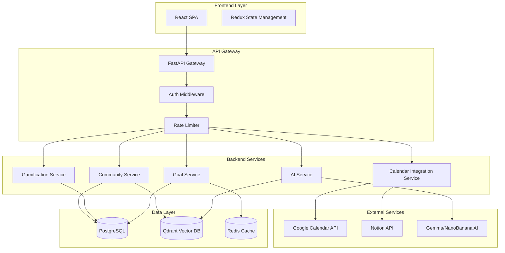

# Design Document: Woop Woop Learning Tracker

## Overview

Woop Woop is a full-stack gamified learning consistency tracker that combines goal management, AI-powered study tools, and community features. The system uses a microservices-inspired architecture with FastAPI backend, React frontend, vector database for semantic search, and containerized deployment.

### Key Design Principles

1. **Modularity**: Separate concerns between goal tracking, AI services, gamification, and community features
2. **Scalability**: Use vector databases and caching for performance at scale
3. **User Experience**: Prioritize smooth interactions with real-time updates and aesthetic feedback
4. **AI-First**: Integrate AI capabilities throughout the user journey with intelligent clarification
5. **Security**: Implement authentication, authorization, and data encryption at all layers

## Architecture

### High-Level Architecture



### Technology Stack

**Frontend:**
- React 18+ with TypeScript
- Redux Toolkit for state management
- TailwindCSS for styling with space theme customization
- Framer Motion for animations and transitions
- React Query for API data fetching and caching
- Recharts for consistency visualizations

**Backend:**
- FastAPI (Python 3.11+) for API layer
- Pydantic for data validation
- SQLAlchemy for ORM
- Alembic for database migrations
- Celery for background tasks (AI processing, calendar sync)
- Redis for caching and task queue

**Data Storage:**
- PostgreSQL 15+ for relational data (users, goals, plans, resources)
- Qdrant for vector embeddings (semantic search)
- Redis for session management and caching

**AI/ML:**
- Gemma or NanoBanana for content generation
- Sentence Transformers for vector embeddings
- LangChain for AI orchestration and prompt management

**Infrastructure:**
- Docker and Docker Compose for containerization
- Nginx as reverse proxy
- Let's Encrypt for SSL certificates
- GitHub Actions for CI/CD

**External Integrations:**
- Google Calendar API (OAuth 2.0)
- Notion API (OAuth 2.0)

## Components and Interfaces

### 1. Authentication and User Management

**Components:**
- `AuthService`: Handles registration, login, JWT token generation
- `UserProfile`: Manages user data and preferences
- `OnboardingSurvey`: Captures initial user goals and preferences

**Key Interfaces:**

```python
class UserCreate(BaseModel):
    email: EmailStr
    password: str
    full_name: str

class UserProfile(BaseModel):
    id: UUID
    email: EmailStr
    full_name: str
    onboarding_completed: bool
    baby_breaking_mode: bool
    created_at: datetime

class OnboardingSurveyResponse(BaseModel):
    subjects: List[str]
    learning_goals: List[str]
    weekly_time_commitment: int  # hours
    preferred_study_times: List[str]
```

### 2. Goal and Planning System

**Components:**
- `GoalManager`: CRUD operations for goals
- `WeeklyPlanService`: Creates and manages weekly plans
- `ConsistencyTracker`: Calculates consistency scores and streaks

**Key Interfaces:**

```python
class Goal(BaseModel):
    id: UUID
    user_id: UUID
    title: str
    subject: str
    description: Optional[str]
    default_duration_minutes: int
    created_at: datetime

class WeeklyPlan(BaseModel):
    id: UUID
    user_id: UUID
    week_start_date: date
    goals: List[PlannedGoal]
    total_planned_hours: float
    created_at: datetime

class PlannedGoal(BaseModel):
    goal_id: UUID
    scheduled_time: datetime
    duration_minutes: int
    priority: int  # 1-5
    completed: bool
    completed_at: Optional[datetime]

class ConsistencyScore(BaseModel):
    user_id: UUID
    current_streak: int
    longest_streak: int
    completion_rate: float  # 0.0 to 1.0
    weekly_scores: List[WeeklyScore]
```

### 3. Calendar Integration Service

**Components:**
- `CalendarConnector`: Abstract base for calendar integrations
- `GoogleCalendarConnector`: Google Calendar implementation
- `NotionConnector`: Notion implementation
- `SyncManager`: Handles bidirectional synchronization

**Key Interfaces:**

```python
class CalendarConnection(BaseModel):
    id: UUID
    user_id: UUID
    provider: str  # "google" or "notion"
    access_token: str  # encrypted
    refresh_token: str  # encrypted
    connected_at: datetime
    last_sync: Optional[datetime]

class CalendarEvent(BaseModel):
    external_id: str
    title: str
    start_time: datetime
    end_time: datetime
    description: Optional[str]
    goal_id: Optional[UUID]  # linked to internal goal

class SyncResult(BaseModel):
    events_created: int
    events_updated: int
    events_deleted: int
    errors: List[str]
```

### 4. AI Service

**Components:**
- `NoteSummarizer`: Processes documents and generates summaries
- `PresentationGenerator`: Creates slide decks from content
- `FlashcardGenerator`: Extracts key concepts and creates Q&A pairs
- `ClarificationEngine`: Asks questions when content is unclear
- `BabyBreakingModeProcessor`: Simplifies explanations with analogies

**Key Interfaces:**

```python
class SummarizationRequest(BaseModel):
    content: str
    file_type: str  # "pdf", "docx", "txt"
    max_length: Optional[int]
    user_id: UUID

class SummarizationResponse(BaseModel):
    summary: str
    key_points: List[str]
    word_count: int
    processing_time: float

class PresentationRequest(BaseModel):
    content: str
    topic: str
    num_slides: Optional[int]
    user_id: UUID
    baby_breaking_mode: bool

class ClarificationQuestion(BaseModel):
    question: str
    context: str
    required: bool

class PresentationResponse(BaseModel):
    clarification_needed: bool
    questions: List[ClarificationQuestion]
    presentation: Optional[Presentation]

class Presentation(BaseModel):
    id: UUID
    title: str
    slides: List[Slide]
    created_at: datetime

class Slide(BaseModel):
    slide_number: int
    title: str
    content: List[str]  # bullet points
    notes: Optional[str]

class FlashcardRequest(BaseModel):
    content: str
    num_cards: Optional[int]
    user_id: UUID

class FlashcardSet(BaseModel):
    id: UUID
    title: str
    cards: List[Flashcard]
    created_at: datetime

class Flashcard(BaseModel):
    question: str
    answer: str
    difficulty: str  # "easy", "medium", "hard"
```

### 5. Gamification Engine

**Components:**
- `RewardSystem`: Manages points and achievements
- `ThemeManager`: Handles visual progression and unlocks
- `TriviaEngine`: Generates and validates trivia questions
- `MotivationalMessageService`: Displays scrolling messages

**Key Interfaces:**

```python
class UserGameProfile(BaseModel):
    user_id: UUID
    total_points: int
    current_level: int
    achievements: List[Achievement]
    unlocked_themes: List[str]
    current_theme: str

class Achievement(BaseModel):
    id: str
    name: str
    description: str
    icon: str
    points_awarded: int
    unlocked_at: datetime

class TriviaQuestion(BaseModel):
    id: UUID
    subject: str
    question: str
    options: List[str]
    correct_answer: int  # index
    difficulty: str
    points: int

class MotivationalMessage(BaseModel):
    text: str
    category: str  # "encouragement", "tip", "quote"
    display_duration: int  # seconds
```

### 6. Community Resource Platform

**Components:**
- `ResourceRepository`: Manages shared resources
- `ResourceSearchEngine`: Semantic search using vector DB
- `RatingSystem`: Handles ratings and reviews
- `ModerationService`: Flags inappropriate content

**Key Interfaces:**

```python
class Resource(BaseModel):
    id: UUID
    title: str
    description: str
    url: str
    resource_type: str  # "article", "video", "tool", "course"
    subject: str
    tags: List[str]
    submitted_by: UUID
    average_rating: float
    rating_count: int
    created_at: datetime
    flagged: bool

class ResourceRating(BaseModel):
    resource_id: UUID
    user_id: UUID
    rating: int  # 1-5
    review: Optional[str]
    created_at: datetime

class ResourceSearchQuery(BaseModel):
    query: str
    subject: Optional[str]
    resource_type: Optional[str]
    min_rating: Optional[float]
    limit: int = 20

class ResourceSearchResult(BaseModel):
    resources: List[Resource]
    total_count: int
    semantic_matches: List[SemanticMatch]

class SemanticMatch(BaseModel):
    resource_id: UUID
    similarity_score: float
```

### 7. Vector Database Integration

**Components:**
- `EmbeddingService`: Generates vector embeddings
- `VectorStore`: Manages Qdrant collections
- `SemanticSearchEngine`: Performs similarity searches

**Key Interfaces:**

```python
class Document(BaseModel):
    id: UUID
    content: str
    metadata: Dict[str, Any]
    document_type: str  # "note", "summary", "resource"
    user_id: UUID

class VectorEmbedding(BaseModel):
    document_id: UUID
    vector: List[float]
    model: str  # embedding model used
    created_at: datetime

class SemanticSearchRequest(BaseModel):
    query: str
    user_id: UUID
    document_types: Optional[List[str]]
    limit: int = 10
    min_similarity: float = 0.7

class SemanticSearchResult(BaseModel):
    document_id: UUID
    content: str
    similarity_score: float
    metadata: Dict[str, Any]
```

## Data Models

### Database Schema (PostgreSQL)

**Users Table:**
```sql
CREATE TABLE users (
    id UUID PRIMARY KEY DEFAULT gen_random_uuid(),
    email VARCHAR(255) UNIQUE NOT NULL,
    password_hash VARCHAR(255) NOT NULL,
    full_name VARCHAR(255) NOT NULL,
    onboarding_completed BOOLEAN DEFAULT FALSE,
    baby_breaking_mode BOOLEAN DEFAULT FALSE,
    created_at TIMESTAMP DEFAULT CURRENT_TIMESTAMP,
    updated_at TIMESTAMP DEFAULT CURRENT_TIMESTAMP
);
```

**Goals Table:**
```sql
CREATE TABLE goals (
    id UUID PRIMARY KEY DEFAULT gen_random_uuid(),
    user_id UUID REFERENCES users(id) ON DELETE CASCADE,
    title VARCHAR(255) NOT NULL,
    subject VARCHAR(100) NOT NULL,
    description TEXT,
    default_duration_minutes INTEGER NOT NULL,
    created_at TIMESTAMP DEFAULT CURRENT_TIMESTAMP,
    updated_at TIMESTAMP DEFAULT CURRENT_TIMESTAMP
);
```

**Weekly Plans Table:**
```sql
CREATE TABLE weekly_plans (
    id UUID PRIMARY KEY DEFAULT gen_random_uuid(),
    user_id UUID REFERENCES users(id) ON DELETE CASCADE,
    week_start_date DATE NOT NULL,
    total_planned_hours FLOAT NOT NULL,
    created_at TIMESTAMP DEFAULT CURRENT_TIMESTAMP,
    updated_at TIMESTAMP DEFAULT CURRENT_TIMESTAMP,
    UNIQUE(user_id, week_start_date)
);
```

**Planned Goals Table:**
```sql
CREATE TABLE planned_goals (
    id UUID PRIMARY KEY DEFAULT gen_random_uuid(),
    weekly_plan_id UUID REFERENCES weekly_plans(id) ON DELETE CASCADE,
    goal_id UUID REFERENCES goals(id) ON DELETE CASCADE,
    scheduled_time TIMESTAMP NOT NULL,
    duration_minutes INTEGER NOT NULL,
    priority INTEGER CHECK (priority BETWEEN 1 AND 5),
    completed BOOLEAN DEFAULT FALSE,
    completed_at TIMESTAMP,
    created_at TIMESTAMP DEFAULT CURRENT_TIMESTAMP
);
```

**Calendar Connections Table:**
```sql
CREATE TABLE calendar_connections (
    id UUID PRIMARY KEY DEFAULT gen_random_uuid(),
    user_id UUID REFERENCES users(id) ON DELETE CASCADE,
    provider VARCHAR(50) NOT NULL,
    access_token_encrypted TEXT NOT NULL,
    refresh_token_encrypted TEXT NOT NULL,
    connected_at TIMESTAMP DEFAULT CURRENT_TIMESTAMP,
    last_sync TIMESTAMP,
    UNIQUE(user_id, provider)
);
```

**Resources Table:**
```sql
CREATE TABLE resources (
    id UUID PRIMARY KEY DEFAULT gen_random_uuid(),
    title VARCHAR(255) NOT NULL,
    description TEXT NOT NULL,
    url TEXT NOT NULL,
    resource_type VARCHAR(50) NOT NULL,
    subject VARCHAR(100) NOT NULL,
    tags TEXT[], -- PostgreSQL array
    submitted_by UUID REFERENCES users(id) ON DELETE SET NULL,
    average_rating FLOAT DEFAULT 0.0,
    rating_count INTEGER DEFAULT 0,
    flagged BOOLEAN DEFAULT FALSE,
    created_at TIMESTAMP DEFAULT CURRENT_TIMESTAMP
);
```

**Resource Ratings Table:**
```sql
CREATE TABLE resource_ratings (
    id UUID PRIMARY KEY DEFAULT gen_random_uuid(),
    resource_id UUID REFERENCES resources(id) ON DELETE CASCADE,
    user_id UUID REFERENCES users(id) ON DELETE CASCADE,
    rating INTEGER CHECK (rating BETWEEN 1 AND 5),
    review TEXT,
    created_at TIMESTAMP DEFAULT CURRENT_TIMESTAMP,
    UNIQUE(resource_id, user_id)
);
```

**User Game Profiles Table:**
```sql
CREATE TABLE user_game_profiles (
    user_id UUID PRIMARY KEY REFERENCES users(id) ON DELETE CASCADE,
    total_points INTEGER DEFAULT 0,
    current_level INTEGER DEFAULT 1,
    current_theme VARCHAR(100) DEFAULT 'default',
    created_at TIMESTAMP DEFAULT CURRENT_TIMESTAMP,
    updated_at TIMESTAMP DEFAULT CURRENT_TIMESTAMP
);
```

**Achievements Table:**
```sql
CREATE TABLE achievements (
    id VARCHAR(100) PRIMARY KEY,
    name VARCHAR(255) NOT NULL,
    description TEXT NOT NULL,
    icon VARCHAR(255) NOT NULL,
    points_awarded INTEGER NOT NULL,
    unlock_criteria JSONB NOT NULL
);
```

**User Achievements Table:**
```sql
CREATE TABLE user_achievements (
    user_id UUID REFERENCES users(id) ON DELETE CASCADE,
    achievement_id VARCHAR(100) REFERENCES achievements(id),
    unlocked_at TIMESTAMP DEFAULT CURRENT_TIMESTAMP,
    PRIMARY KEY (user_id, achievement_id)
);
```

**Generated Content Table:**
```sql
CREATE TABLE generated_content (
    id UUID PRIMARY KEY DEFAULT gen_random_uuid(),
    user_id UUID REFERENCES users(id) ON DELETE CASCADE,
    content_type VARCHAR(50) NOT NULL, -- "summary", "presentation", "flashcards"
    title VARCHAR(255) NOT NULL,
    content JSONB NOT NULL,
    source_content TEXT,
    created_at TIMESTAMP DEFAULT CURRENT_TIMESTAMP
);
```

### Vector Database Schema (Qdrant)

**Collections:**

1. **user_notes_collection**: Stores embeddings for user-uploaded notes and summaries
   - Vector dimension: 384 (sentence-transformers/all-MiniLM-L6-v2)
   - Payload: `{user_id, document_id, content_preview, document_type, created_at}`

2. **resources_collection**: Stores embeddings for community resources
   - Vector dimension: 384
   - Payload: `{resource_id, title, description, subject, tags, average_rating}`

## Correctness Properties


*A property is a characteristic or behavior that should hold true across all valid executions of a system—essentially, a formal statement about what the system should do. Properties serve as the bridge between human-readable specifications and machine-verifiable correctness guarantees.*

### Property 1: Onboarding Data Capture and Profile Creation

*For any* valid onboarding survey response with at least one goal, submitting the survey should create a user profile containing all submitted goals, subjects, and preferences, and the retrieved profile should match the submitted data.

**Validates: Requirements 1.2, 1.3, 1.4**

### Property 2: Weekly Plan Persistence and Retrieval

*For any* valid weekly plan with goals, time allocations, and priorities, saving the plan should persist it to the database, and retrieving the plan should return an equivalent plan with all goals, schedules, and metadata intact.

**Validates: Requirements 2.2, 2.5**

### Property 3: Weekly Plan Time Recalculation

*For any* weekly plan modification (adding, removing, or changing goal durations), the total planned hours should equal the sum of all individual goal durations in the updated plan.

**Validates: Requirements 2.3**

### Property 4: Weekly Plan Duplication

*For any* existing weekly plan, duplicating it should create a new plan with equivalent goals, durations, and priorities, but with a different plan ID and updated timestamps.

**Validates: Requirements 2.6**

### Property 5: Calendar Event Synchronization

*For any* goal added to a weekly plan with connected calendars, a corresponding calendar event should be created in all connected calendars, and modifying the event externally should update the weekly plan accordingly.

**Validates: Requirements 3.3, 3.4**

### Property 6: Calendar Disconnection Cleanup

*For any* calendar connection, disconnecting it should remove all integration data and prevent future synchronization attempts for that calendar provider.

**Validates: Requirements 3.5**

### Property 7: Consistency Score Calculation

*For any* set of planned and completed goals over a time period, the consistency score should equal the ratio of completed goals to planned goals, and marking goals as complete or incomplete should update the score accordingly.

**Validates: Requirements 4.1, 4.2, 4.3**

### Property 8: Historical Consistency Data Retrieval

*For any* user with goal completion history, retrieving consistency metrics should return exactly 12 weeks of data including completion rates, streaks, and trends.

**Validates: Requirements 4.5, 4.6**

### Property 9: Milestone Rewards

*For any* consistency milestone achievement (streak, completion rate threshold), the gamification engine should award the corresponding points and unlock associated rewards.

**Validates: Requirements 5.1**

### Property 10: Subject-Relevant Trivia

*For any* user with defined learning subjects, presented trivia questions should relate to at least one of those subjects, and correct answers should award bonus points.

**Validates: Requirements 5.4, 5.5**

### Property 11: Achievement Level Unlocks

*For any* user reaching a new achievement level, the system should unlock new visual themes and customization options corresponding to that level.

**Validates: Requirements 5.7**

### Property 12: Note Summarization Round Trip

*For any* valid document (PDF, DOCX, or plain text), uploading it should trigger summarization, generate a summary, and saving the summary should allow retrieval of both the summary and original content.

**Validates: Requirements 6.1, 6.2, 6.5**

### Property 13: Summarization Error Handling

*For any* document that fails summarization (invalid format, corrupted file, processing error), the system should return a descriptive error message indicating the failure reason.

**Validates: Requirements 6.6**

### Property 14: Resource Organization and Display

*For any* set of community resources, displaying them should organize resources by subject and order them by popularity (rating and rating count), with higher-rated resources appearing first within each subject.

**Validates: Requirements 7.1**

### Property 15: Resource Submission Validation

*For any* resource submission, the system should validate required fields (title, description, URL, subject), accept valid submissions, and reject invalid submissions with descriptive error messages.

**Validates: Requirements 7.2**

### Property 16: Resource Search Correctness

*For any* search query with subject, tags, or rating filters, all returned resources should match the specified criteria, and results should be ranked by semantic similarity when using text search.

**Validates: Requirements 7.4, 11.2, 11.3**

### Property 17: Resource Flagging

*For any* resource with an average rating below 2.0 (out of 5), the system should automatically flag it for moderation review.

**Validates: Requirements 7.6**

### Property 18: Resource Bookmarking Round Trip

*For any* resource, bookmarking it should persist the bookmark, and retrieving bookmarks should include that resource until it is unbookmarked.

**Validates: Requirements 7.7**

### Property 19: AI Clarification Questions (CRITICAL)

*For any* presentation or flashcard generation request with unclear, ambiguous, or insufficient content, the AI assistant should ask at least one clarifying question before generating output, and should not generate output until questions are answered.

**Validates: Requirements 8.2**

### Property 20: Presentation Generation After Clarification

*For any* presentation request where clarifying questions have been answered, the AI assistant should generate a structured presentation with slides containing titles and content.

**Validates: Requirements 8.3**

### Property 21: Flashcard Structure

*For any* flashcard generation request, the output should be a set of flashcards where each card contains a question and an answer, and the number of cards should not exceed the requested amount.

**Validates: Requirements 8.4**

### Property 22: Generated Content Persistence

*For any* generated presentation or flashcard set, saving it should persist the content to the database, and retrieving it should return the complete generated content with all slides or cards intact.

**Validates: Requirements 8.6**

### Property 23: Baby Breaking Mode Prompt Modification

*For any* AI assistant prompt when Baby Breaking Mode is enabled, the system should append "Explain this like I am a 3 YO" to the prompt before sending it to the AI model.

**Validates: Requirements 9.2**

### Property 24: Baby Breaking Mode Toggle

*For any* user, enabling Baby Breaking Mode then disabling it should revert AI prompts to standard format without the simplification suffix.

**Validates: Requirements 9.4**

### Property 25: Baby Breaking Mode Persistence

*For any* Baby Breaking Mode preference setting, logging out and logging back in should preserve the preference setting across sessions.

**Validates: Requirements 9.5**

### Property 26: Data Persistence Round Trip

*For any* user data modification (goals, plans, preferences, generated content), the changes should be immediately persisted to the database, and subsequent retrieval should return the modified data.

**Validates: Requirements 10.1**

### Property 27: Credential Encryption

*For any* sensitive data stored in the database (passwords, calendar tokens), the stored value should be encrypted and should not match the plaintext value.

**Validates: Requirements 10.2**

### Property 28: Authentication Validation

*For any* login attempt, providing correct credentials should succeed and return an authentication token, while providing incorrect credentials should fail and return an authentication error.

**Validates: Requirements 10.3**

### Property 29: Vector Embedding Generation

*For any* uploaded content (note, summary, resource), the system should generate vector embeddings and store them in the vector database within the processing pipeline.

**Validates: Requirements 11.1**

### Property 30: API Authentication

*For any* API request without a valid authentication token, the system should reject the request with a 401 Unauthorized status code.

**Validates: Requirements 12.2**

### Property 31: API Response Format

*For any* successful API request, the response should be valid JSON with an appropriate HTTP status code (2xx for success, 4xx for client errors, 5xx for server errors).

**Validates: Requirements 12.3**

### Property 32: API Error Messages

*For any* API error (validation failure, not found, server error), the response should include a descriptive error message explaining what went wrong.

**Validates: Requirements 12.4**

### Property 33: Rate Limiting

*For any* user exceeding the configured rate limit (e.g., 100 requests per minute), subsequent requests should be rejected with a 429 Too Many Requests status code until the rate limit window resets.

**Validates: Requirements 12.5**

### Property 34: Health Check Endpoint

*For any* health check request to the `/health` endpoint, the system should return a 200 OK status with service status information when all services are operational.

**Validates: Requirements 13.4**

## Error Handling

### Error Categories

1. **Validation Errors**: Invalid input data, missing required fields
   - Return 400 Bad Request with field-specific error messages
   - Example: Missing goal title, invalid email format

2. **Authentication Errors**: Invalid credentials, expired tokens
   - Return 401 Unauthorized for invalid credentials
   - Return 403 Forbidden for insufficient permissions

3. **Not Found Errors**: Requested resource doesn't exist
   - Return 404 Not Found with resource identifier
   - Example: Goal ID not found, user not found

4. **External Service Errors**: Calendar API failures, AI model errors
   - Implement retry logic with exponential backoff
   - Return 503 Service Unavailable if service is down
   - Log errors for monitoring and debugging

5. **Rate Limiting Errors**: Too many requests
   - Return 429 Too Many Requests with retry-after header
   - Implement per-user and per-IP rate limiting

6. **Server Errors**: Unexpected exceptions, database errors
   - Return 500 Internal Server Error
   - Log full stack trace for debugging
   - Never expose internal details to clients

### Error Response Format

All errors should follow a consistent JSON structure:

```json
{
  "error": {
    "code": "VALIDATION_ERROR",
    "message": "Invalid input data",
    "details": [
      {
        "field": "title",
        "message": "Title is required"
      }
    ],
    "timestamp": "2024-01-15T10:30:00Z",
    "request_id": "req_abc123"
  }
}
```

### Retry and Fallback Strategies

1. **Calendar Sync Failures**: Queue for retry, notify user of sync issues
2. **AI Generation Failures**: Provide fallback options, allow manual creation
3. **Vector DB Failures**: Fall back to keyword search, queue for re-indexing
4. **Database Connection Failures**: Implement connection pooling and retry logic

## Testing Strategy

### Dual Testing Approach

The testing strategy combines unit tests for specific examples and edge cases with property-based tests for universal correctness properties. Both approaches are complementary and necessary for comprehensive coverage.

**Unit Tests:**
- Focus on specific examples that demonstrate correct behavior
- Test edge cases (empty inputs, boundary values, special characters)
- Test error conditions and exception handling
- Test integration points between components
- Verify specific UI behaviors and user flows

**Property-Based Tests:**
- Verify universal properties across all inputs using randomized test data
- Run minimum 100 iterations per property test
- Each property test references its design document property
- Tag format: `Feature: woop-woop-learning-tracker, Property {number}: {property_text}`

### Testing Framework Selection

**Backend (Python/FastAPI):**
- **Unit Testing**: pytest with pytest-asyncio for async tests
- **Property-Based Testing**: Hypothesis library
- **API Testing**: httpx for async HTTP client testing
- **Database Testing**: pytest-postgresql for test database fixtures
- **Mocking**: pytest-mock for external service mocking

**Frontend (React/TypeScript):**
- **Unit Testing**: Vitest with React Testing Library
- **Property-Based Testing**: fast-check library
- **Component Testing**: Vitest with jsdom
- **E2E Testing**: Playwright for critical user flows

### Test Organization

```
backend/
  tests/
    unit/
      test_auth.py
      test_goals.py
      test_calendar_sync.py
      test_ai_service.py
    properties/
      test_goal_properties.py
      test_consistency_properties.py
      test_ai_properties.py
    integration/
      test_api_endpoints.py
      test_calendar_integration.py

frontend/
  tests/
    unit/
      components/
      hooks/
      utils/
    properties/
      goal-planning.test.ts
      consistency-tracking.test.ts
    e2e/
      onboarding.spec.ts
      goal-management.spec.ts
```

### Property Test Configuration

Each property-based test must:
1. Run minimum 100 iterations with randomized inputs
2. Include a comment tag referencing the design property
3. Test the universal property across all valid input ranges
4. Handle edge cases through the property definition

Example property test structure:

```python
# Feature: woop-woop-learning-tracker, Property 2: Weekly Plan Persistence and Retrieval
@given(weekly_plan=weekly_plan_strategy())
@settings(max_examples=100)
def test_weekly_plan_round_trip(weekly_plan):
    """For any valid weekly plan, save then retrieve should return equivalent plan."""
    saved_plan = save_weekly_plan(weekly_plan)
    retrieved_plan = get_weekly_plan(saved_plan.id)
    assert_plans_equivalent(weekly_plan, retrieved_plan)
```

### Critical Test Coverage Areas

1. **AI Clarification (Property 19)**: Must verify that unclear content triggers questions
2. **Calendar Bidirectional Sync (Property 5)**: Test both directions of synchronization
3. **Consistency Score Calculation (Property 7)**: Verify mathematical correctness
4. **Data Encryption (Property 27)**: Ensure sensitive data is never stored in plaintext
5. **Rate Limiting (Property 33)**: Verify limits are enforced correctly

### Integration Testing

Integration tests should cover:
- End-to-end user flows (onboarding → goal creation → tracking → rewards)
- External API integrations (Google Calendar, Notion, AI models)
- Database transactions and rollbacks
- Background task processing (Celery tasks)
- WebSocket connections for real-time updates

### Performance Testing

While not part of the core property tests, performance benchmarks should be established for:
- API response times (< 200ms for most endpoints)
- Vector search queries (< 500ms)
- AI generation (< 10s for summaries, < 30s for presentations)
- Calendar sync operations (< 5s per event)

### Continuous Integration

All tests should run automatically on:
- Pull request creation
- Commits to main branch
- Nightly builds for extended property test runs (1000+ iterations)

Test coverage targets:
- Unit test coverage: > 80%
- Property test coverage: All 34 properties implemented
- Integration test coverage: All critical user flows
