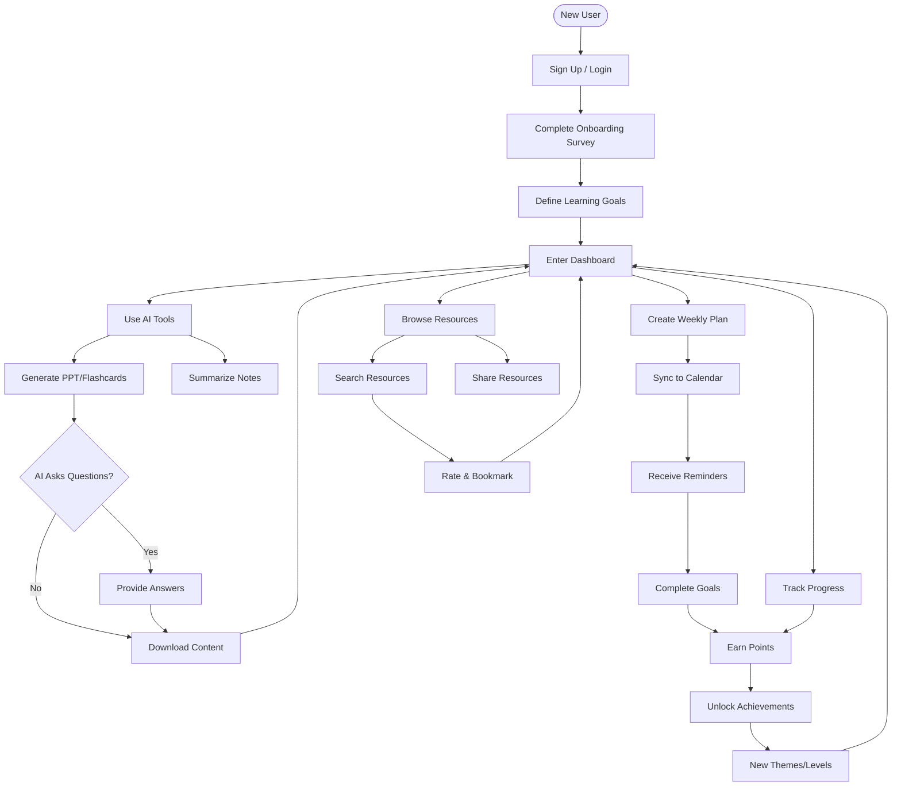
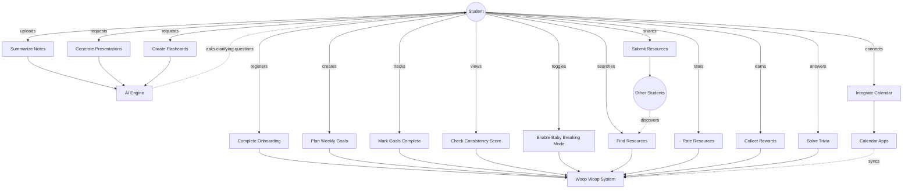
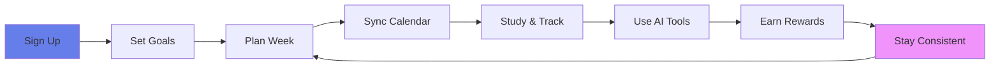
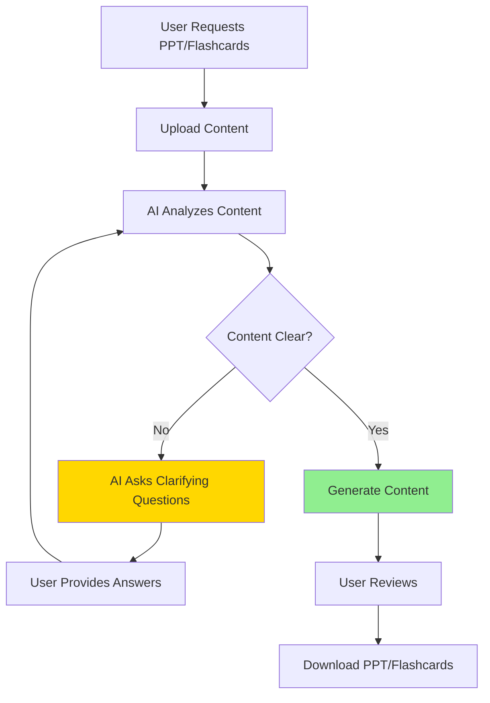

# Woop Woop - Process Flow & Use Case Diagrams

## 1. User Journey Process Flow

## 2. Use Case Diagram

## 3. Simplified Linear Flow (For Presentation Slide)

## 4. AI Clarification Flow (Key Feature)

---

3. **Recommended for your presentation**:
   - Use diagram #3 (Simplified Linear Flow) for overview slide
   - Use diagram #4 (AI Clarification Flow) to highlight USP
   - Use diagram #2 (Use Case) for technical audience
